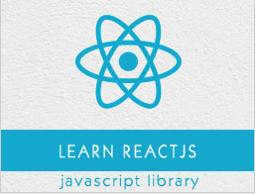

```
Roberto Nogueira  
BSd EE, MSd CE
Solution Integrator Experienced - Certified by Ericsson
```
# TutorialsPoint React.js



**About**

Learn everything you need to about the subject of this `Tutorialspoint React.js` project.

[Homepage](https://www.tutorialspoint.com/reactjs/index.htm)

## Topics
```
ReactJS Tutorial
[ ] Home
[ ] Overview
[ ] Environment Setup
[ ] JSX
[ ] Components
[ ] State
[ ] Props Overview
[ ] Props Validation
[ ] Component API
[ ] Component Life Cycle
[ ] Forms
[ ] Events
[ ] Refs
[ ] Keys
[ ] Router
[ ] Flux concept
[ ] Using Flux
[ ] Animations
[ ] Higher order Components
[ ] Best Practices
Useful Resources
[ ] Quick Guide
[ ] Useful Resources
[ ] Discussion
Selected Reading
[ ] Developer's Best Practices
[ ] Questions and Answers
[ ] Effective Resume Writing
[ ] HR Interview Questions
[ ] Computer Glossary
[ ] Who is Who
```
